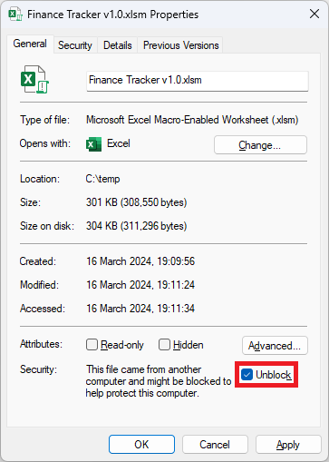

  
  
  <h3 align="center">Finance Tracker</h1     
                                      
  

    Budget tracking made easy!
  

## About

This Excel workbook is designed to help track your expenses, provide insights into your spending habits, and save time managing your finances every month.

## Getting Started
1. Download a copy of the workbook from the [Releases](https://github.com/stuartgrubb/FinanceTracker/releases) section.

2. Right click the file &#8594; select **Properties** &#8594; tick **Unblock** &#8594; select **Apply** &#8594; select **Ok**

      

3. Enable macros to allow the automated functions to work

   Note: All VBA functions are publicly available for review [here](https://github.com/stuartgrubb/FinanceTracker/tree/master/VBA).

    

5. Start by adding an income source, bills, and any other categories you require by clicking the **Add/Edit** button under each section.

    

6. Select **Start** &#8594; choose the **month/year** using the drop down boxes &#8594; select **Ok**.

    

7. Enter the values of each item. This will present the remaining balance and calculate the percentage spent on each category.

    

7. Once you have finished entering data for that month click **Save**.

  Note: You can always revisit and make changes for that month by repeating step 5.
    

8. When it's time to track expenses for the next month, **tick the autofill checkbox** to copy the data from the previous month.
This removes the need to re-enter all the values again and instead make adjustments where required.

    

## Data
All data is stored within the hidden "Keystone" and "Data" sheets.

You can view the raw data by either unhiding those sheets or by exporting a copy: **Start** &#8594; **Options** &#8594; **Export Data**

## Themes
Start &#8594; Options &#8594; Change Theme

